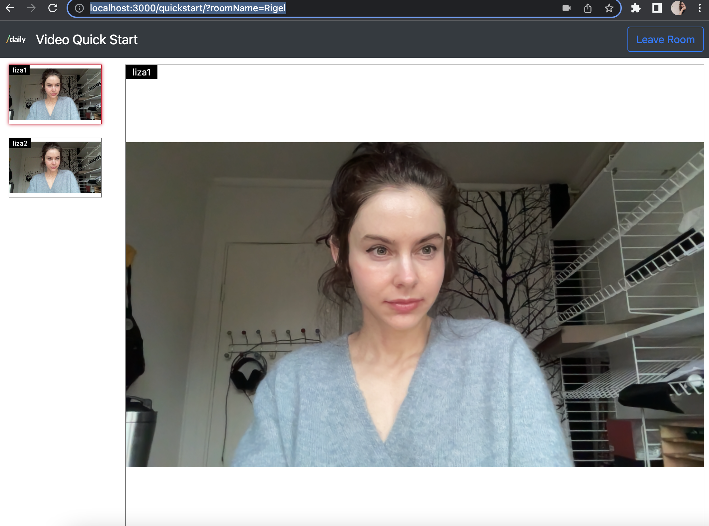

# Twilio to Daily Video Quickstart Migration for JavaScript

## Overview

This application demonstrates a migration of Twilio's Quickstart JavaScript video demo to [`daily-js`](https://docs.daily.co/reference/daily-js), Daily's Client SDK for JavaScript.

This demo is a basic migration implementation and is not optimized for large calls. Daily supports large real-time calls of 1,000 active participants. If you're building for higher participant counts, we recommend checking out our [best practices for scaling large calls](https://docs.daily.co/guides/scaling-calls/best-practices-to-scale-large-experiences)



## Setup Requirements

First, sign up for a [free Daily account](https://dashboard.daily.co/signup), and take note of your Daily API key in the [developer dashboard](https://dashboard.daily.co/developers).

1. `git clone git@github.com:daily-demos/twilio-daily-conversion.git`
1. `cd twilio-daily-conversion`

## Setting Up The Application

Create a configuration file for your application. From within the `twilio-daily-conversion` directory on your machine, run the following:

```bash
cp .env.template .env
```

Edit `.env` with the Daily API key you copied from the Daily developer dashboard earlier.

Next, we need to install our dependencies from npm:

```bash
npm install
```

## Running The Application

Now we should be all set! Run the application:

```bash
npm start
```

Your application should now be running at [http://localhost:3000](http://localhost:3000). You will
be prompted to test and choose your microphone and camera. On desktop browsers, your choices will
be saved. _On mobile browsers, you will be asked to test and choose your microphone and camera every
time you load the application in order to make sure they are not reserved by another application_.

After choosing your input devices, you will be prompted to enter your Room name and user name, following
which you will join the Room. Now, all you have to do is open another tab and join the same Room in order
to see and hear yourself on both tabs!

[joinroom.js](quickstart/src/joinroom.js) demonstrates how to use the SDK APIs to build a multi-party
video sesssion. You can start building your own application by incorporating this code into your own
application, and build your user interface around it.

## Running On Multiple Devices

You can use [ngrok](https://ngrok.com/) to try your application
on different devices by creating a secure tunnel to your application server:

```bash
ngrok http 3000
```

You will get a URL of the form `https://a1b2c3d4.ngrok.io` which can be loaded on a browser from a device
different than the one where your application server is running.

## Examples

The project contains some use-case examples for the Twilio Video JS SDK. These will be converted to Daily in the future to show more feature-specific migration steps for different parts of the API.